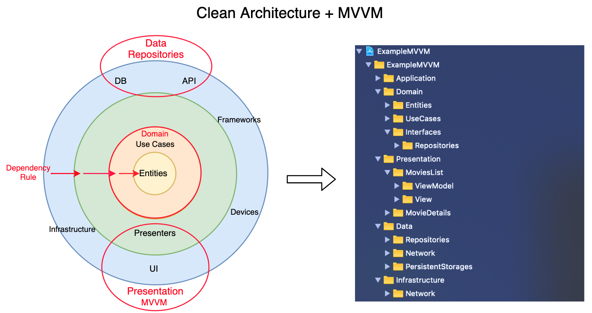

# Cash Handler

Esse projeto é uma aplicação de uma arquitetura MVVM com Clean junto do SwiftUI.

## Architecture

O projeto são dividos em 2 módulos macros: _App_ (chamado de Charles) e _Modules_ (um __package__ criado com SPM). 

O _Modules_ possui a parte mais densa de código do projeto, já o _App_ é mais responsável por integrar o fluxo das features usando _coordinators_ e realizar a injeção de dependência usando várias _factories_.

### _Modules_

A divisão dos _targets_ dentro do _Modules_ segue uma divisão do Clean Architecture e alguns outros módulos na função de _utils/commons_. Cada target tem seu objetivo bem demarcado, sendo esses:

- __Common__: Contém _extensions_, _utils e outros componentes/classes que facilitam o desenvolvimento e configurações em geral. Ele é acessível para todos os módulos, menos o __domain__.
- __Data__: Esse _target_ é dedicado a implementar a obtenção de dados por meio de _data sources_ e _repositories_. Os _data sources_ são responsáveis por integrar com APIs (e.g. _RemoteDataSource_), integrar com banco de dados locais (e.g. _LocalDataSource_) ou integrar com qualquer outra fonte de dados. Já os _repositories_ (implementações das interfaces declaradas no módulo de __domain__) integram as regras para obter as informações pelos _data sources_. Essa camada usa um modelo para cada origem de dado (e.g. modelo de banco de dados e modelo de requests). O _repository_ também é responsável por converter os modelos dessa camada para os modelos que serão utilizados no aplicativo (declarados na camada __domain__).
- __DesginSystem__: Aqui é implementado o padrão de componentes e de cores, fontes, espaçamentos, sombras etc. Essa classe declara uma _enum_ chamada _DesignSystem_ que deve ser extendida para cada feature e conter seus _magic numbers_.
- __Domain__: Toda a regra de negócio do aplicativo é criada nesse módulo. Ele é dividido por contexto, ou seja, cada contexto tem seu _use case_ (classe responsável por implementar as regras de negócios). Aqui também é declarado as interfaces dos repositories, pois os _use cases_ irão utilizar essa interface para obter os dados. Além disso, os modelos que serão utilizados para implementar as regras de negócios do aplicativo também ficam aqui, ou seja, aqui centraliza toda a lógica da aplicação. Outro ponto importante é que essa camada __não deve possuir nenhuma dependência__, ou seja, ela utiliza somente recursos nativos da linguagem.
- __Features (or Presentation)__ (e.g. _Home_, _OperationForm_): A camada de UI de cada feature é criada aqui. Componentes como _Views_ e _ViewModels_, assim como os modelos de UI que serão utilizados pelas _Views_ para apresentação, são declarados aqui. Essa camada tem livre acesso para os módulos em comum (e.g. _DesignSystem_, _Common_), mas não deve ter outra dependência de negócio além da __domain__.

> Original Image: https://tech.olx.com/clean-architecture-and-mvvm-on-ios-c9d167d9f5b3

### _App (Charles)_

O aplicativo tem acesso as _features_, _data_ e _domain_ do _modules_ para realizar o gerenciamento de fluxos e a injeção de dependência dos componentes. A injeção é feita por meio de _factories_, ou seja, é criada uma _factory_ para cada tipo de componente (e.g. _view model_, _use case_, _repositories_) que entende e gera os componente com suas devidas dependências criadas. Já os componentes reponsáveis pela gerencia dos fluxos são os _coordinators_. Para cara tela é criado um _coordinator_ que é responsável por entender para qual _coordinator_ determinada tela tem que redirecionar o fluxo.
